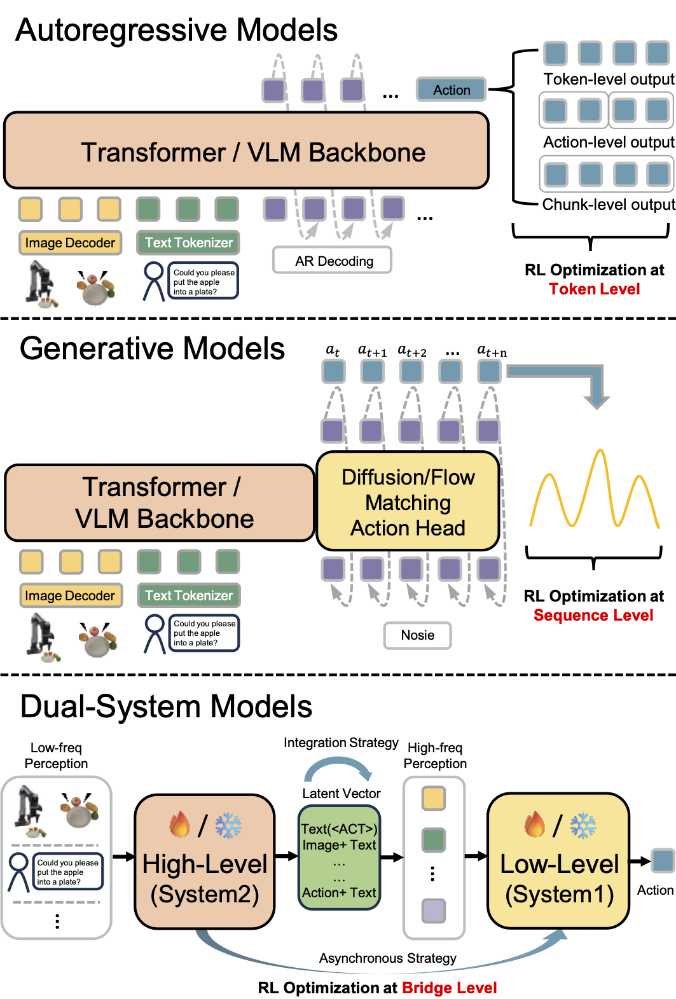

# Awesome RL-VLA for Robotic Manipulation 🤖

A curated list of papers and resources on **Reinforcement Learning of Vision-Language-Action (RL-VLA)** models for Robotic Manipulation. This repository provides a comprehensive overview of training paradigms, methodologies, and state-of-the-art approaches in RL-VLA research.

## 📢 Latest News

> 🔥 **[November 2025]** Our comprehensive survey paper **"A Survey on Reinforcement Learning of Vision-Language-Action Models for Robotic Manipulation"** is now available on [TechRxiv](https://doi.org/10.36227/techrxiv.176531955.54563920/v1)! Stay tuned for future updates.
> 

## 📖 Table of Contents
- [Awesome RL-VLA for Robotic Manipulation 🤖](#awesome-rl-vla-for-robotic-manipulation-)
  - [📢 Latest News](#-latest-news)
  - [📖 Table of Contents](#-table-of-contents)
  - [🔍 Overview](#-overview)
  - [🚀 Training Paradigms](#-training-paradigms)
    - [Offline RL-VLA](#offline-rl-vla)
    - [Online RL-VLA](#online-rl-vla)
    - [Test-time RL-VLA](#test-time-rl-vla)
  - [📚 Paper Collection](#-paper-collection)
    - [Legend](#legend)
    - [Offline RL-VLA](#offline-rl-vla-1)
    - [Online RL-VLA](#online-rl-vla-1)
    - [Offline + Online RL-VLA](#offline--online-rl-vla)
    - [Test-time RL-VLA](#test-time-rl-vla-1)
  - [🔗 Useful Resources](#-useful-resources)
    - [🎯 RL-VLA Action Optimization](#-rl-vla-action-optimization)
    - [Base VLA Models](#base-vla-models)
    - [Datasets \& Benchmarks](#datasets--benchmarks)
    - [Frameworks \& Tools](#frameworks--tools)
  - [🤝 Contributing](#-contributing)
    - [Contribution Guidelines](#contribution-guidelines)
  - [📄 Citation](#-citation)
  - [⭐ Star History](#-star-history)

## 🔍 Overview

RL training is crucial for enabling VLAs to generalize out-of-distribution (OOD) from large-scale pre-trained data. Existing RL-VLA training paradigms can be categorized into three types based on how agents obtain and utilize feedback from the environment:

- **Online RL-VLA**: Direct interaction with the environment during training
- **Offline RL-VLA**: Learning from static datasets without further environmental interaction  
- **Test-time RL-VLA**: Models adapt their behavior during deployment without altering parameters

## 🚀 Training Paradigms

### Offline RL-VLA

Offline RL trains VLA models on pre-collected static datasets, enabling learning independently from environment interactions. This paradigm is suitable for high-risk or resource-constrained deployment scenarios.

**Key Research Directions:**
- **Data Utilization**: Effective utilization of static datasets for policy improvement
- **Objective Modification**: Customizing RL objectives for novel architectures and data augmentation

### Online RL-VLA

Online RL-VLA enables interactive policy learning through continuous environment interaction, empowering pre-trained VLAs with adaptive closed-loop control capability for real-world OOD environments.

**Key Research Directions:**
- **Policy Optimization**: Direct policy improvement based on environmental rewards
- **Sample Efficiency**: Learning effective policies with limited interaction budget
- **Active Exploration**: Efficient exploration strategies for higher performance gains
- **Training Stability**: Ensuring consistent policy updates and convergence
- **Infrastructure**: Scalable frameworks for online RL-VLA training

### Test-time RL-VLA

Test-time RL-VLA adapts behavior during deployment through lightweight updates, addressing the expensive cost of full model fine-tuning in real-world scenarios.

**Key Adaptation Mechanisms:**
- **Value Guidance**: Using pre-trained value functions to influence action selection
- **Memory Buffer Guidance**: Retrieving relevant historical experiences during inference
- **Planning-guided Adaptation**: Explicit reasoning over future action sequences

## 📚 Paper Collection

### Legend
- **Action**: AR (Autoregressive), Diffusion, Flow (Flow-matching)
- **Reward**: D (Dense Reward), S (Sparse Reward)
- **Model Type**: MB (Model-based), MF (Model-free)
- **Environment**: Sim. (Simulation), Real (Real-world)

### Offline RL-VLA

| Method | Date | Sim. | Real | Base VLA Model | Action | Reward | Algorithm | Type | Project |
|--------|------|------|------|----------------|--------|---------|-----------|------|---------|
| [Q-Transformer](https://arxiv.org/abs/2309.10150) | 2023.10 | ✓ | ✗ | Transformer | AR | S | CQL | MF | [🔗](https://qtransformer.github.io/) |
| [PAC](https://arxiv.org/abs/2402.05546) | 2024.02 | ✓ | ✓ | Perceiver-Actor-Critic | AR | S | AC | MF | [🔗](https://sites.google.com/view/perceiver-actor-critic) |
| [GeRM](https://arxiv.org/pdf/2403.13358) | 2024.03 | ✓ | ✗ | Transformer-MoE | AR | S | CQL | MF | [🔗](https://songwxuan.github.io/GeRM/) RL-VLA for Quadruped Locomotion|
| [MoRE](https://arxiv.org/pdf/2503.08007) | 2025.03 | ✗ | ✓  | MLLM-MoE | AR | S | CQL | MF |  -  RL-VLA for Quadruped Locomotion|
| [ReinboT](https://icml.cc/virtual/2025/poster/45523) | 2025.05 | ✓ | ✓ | ReinboT | AR | D | DT + RTG | MF | - |
| [CO-RFT](https://arxiv.org/pdf/2508.02219) | 2025.08 | ✗ | ✓ | RoboVLMs | AR | D | Cal-QL + TD3 | MF | - |
| [ARFM](https://arxiv.org/pdf/2509.04063) | 2025.09 | ✓ | ✓ | π₀ | Flow | D | ARFM | MF | - |
| [$π^*_{0.6}$](https://arxiv.org/abs/2511.14759) | 2025.11 | ✗ | ✓ | $π_{0.6}$ | Flow | D | RECAP | MF | [🔗](https://www.pi.website/blog/pistar06) |
| [NORA-1.5](https://arxiv.org/pdf/2511.14659) | 2025.11 | ✓ | ✓ | NORA-1.5 | AR / Flow | D | DPO | MB | [🔗](https://declare-lab.github.io/nora-1.5) |


### Online RL-VLA

| Method | Date | Sim. | Real | Base VLA Model | Action | Reward | Algorithm | Type | Project |
|--------|------|------|------|----------------|--------|---------|-----------|------|---------|
| [FLaRe](https://arxiv.org/abs/2409.16578) | 2024.09 | ✓ | ✓ | SPOC | AR | S | PPO | MF | [🔗](https://github.com/JiahengHu/FLaRe) |
| [PA-RL](https://arxiv.org/abs/2412.06685) | 2024.12 | ✓ | ✓ | OpenVLA | AR | S | PA-RL | MF | [🔗](https://policyagnosticrl.github.io/) |
| [RLDG](https://arxiv.org/pdf/2412.09858) | 2024.12 | ✗ | ✓ | OpenVLA / Octo | AR / Diffusion | S | RLPD | MF | [🔗](https://generalist-distillation.github.io/) |
| [iRe-VLA](https://arxiv.org/abs/2501.16664) | 2025.01 | ✓ | ✓ | iRe-VLA | AR | S | SACfD + SFT | MF | - |
| [GRAPE](https://arxiv.org/pdf/2411.19309) | 2025.02 | ✓ | ✓ | OpenVLA | AR | D | TPO | MF | [🔗](https://github.com/aiming-lab/grape) |
| [SafeVLA](https://arxiv.org/abs/2503.03480) | 2025.03 | ✓ | ✗ | SPOC | AR | S | PPO | MF | [🔗](https://sites.google.com/view/pku-safevla) |
| [RIPT-VLA](https://arxiv.org/abs/2505.17016) | 2025.05 | ✓ | ✗ | QueST / OpenVLA-OFT | AR | S | LOOP | MF | [🔗](https://ariostgx.github.io/ript_vla/) |
| [VLA-RL](https://arxiv.org/abs/2505.18719) | 2025.05 | ✓ | ✗ | OpenVLA | AR | D | PPO | MF | [🔗](https://github.com/GuanxingLu/vlarl) |
| [RLVLA](https://arxiv.org/abs/2505.19789) | 2025.05 | ✓ | ✗ | OpenVLA | AR | S | PPO / GRPO / DPO | MF | [🔗](https://github.com/gen-robot/RL4VLA) |
| [RFTF](https://arxiv.org/abs/2505.19767) | 2025.05 | ✓ | ✗ | GR-MG, Seer | AR | D | PPO | MF | - |
| [TGRPO](https://arxiv.org/abs/2506.08440) | 2025.06 | ✓ | ✗ | OpenVLA | AR | D | GRPO | MF | - |
| [RLRC](https://arxiv.org/pdf/2506.17639) | 2025.06 | ✓ | ✗ | OpenVLA | AR | S | PPO | MF | [🔗](https://rlrc-vla.github.io/) |
| [ThinkAct](https://arxiv.org/abs/2507.16815) | 2025.07 | ✓ | ✗ | MLLM + DiT | AR / Diffusion | D | GRPO (System 2) | MF | [🔗](https://jasper0314-huang.github.io/thinkact-vla/) |
| [SimpleVLA-RL](https://arxiv.org/pdf/2509.09674) | 2025.09 | ✓ | ✓ | OpenVLA-OFT | AR | S | GRPO | MF | [🔗](https://github.com/PRIME-RL/SimpleVLA-RL) |
| [Dual-Actor FT](https://arxiv.org/pdf/2509.13774) | 2025.09 | ✓ | ✓ | Octo / SmolVLA | Diffusion | S | QL + BC | MF | [🔗](https://sites.google.com/view/hil-daft/) |
| [Generalist](https://arxiv.org/pdf/2509.15155) | 2025.09 | ✓ | ✓ | PaLI 3B | AR | D | REINFORCE | MF | [🔗](https://self-improving-efms.github.io./) |
| [VLAC](https://arxiv.org/abs/2509.15937) | 2025.09 | ✗ | ✓ | VLAC | AR | D | PPO | MF | [🔗](https://github.com/InternRobotics/VLAC) |
| [AC PPO](https://arxiv.org/pdf/2509.25718) | 2025.09 | ✓ | ✗ | Octo-small | AR | S | PPO+BC | MF | - |
| [VLA-RFT](https://arxiv.org/abs/2510.00406) | 2025.10 | ✓ | ✗ | VLA-Adapter | Flow | D | GRPO | MB | [🔗](https://vla-rft.github.io/) |
| [RLinf-VLA](https://arxiv.org/pdf/2510.06710v1) | 2025.10 | ✓ | ✓ | OpenVLA / OpenVLA-OFT | AR | S | PPO / GRPO | MF | [🔗](https://github.com/RLinf/RLinf) |
| [FPO](https://arxiv.org/pdf/2510.09976) | 2025.10 | ✓ | ✗ | π₀ | Flow | S | FPO | MF | - |
| [ReSA](https://arxiv.org/pdf/2510.12710) | 2025.10 | ✓ | ✗ | OpenVLA | AR | D | PPO + SFT | MF | - |
| [π_RL](https://arxiv.org/abs/2510.25889) | 2025.10 | ✓ | ✗ | π₀ / π₀.₅ | Flow | S | PPO / GRPO | MF | [🔗](https://github.com/RLinf/RLinf) |
| [PLD](https://arxiv.org/abs/2511.00091) | 2025.10 | ✓ | ✓ | OpenVLA / π₀ / Octo | AR / Flow | S | Cal-QL + SAC | MF | [🔗](https://www.wenlixiao.com/self-improve-VLA-PLD) |
| [DeepThinkVLA](https://arxiv.org/abs/2511.15669) | 2025.10 | ✓ | ✗ | π₀-Fast | AR | S | GRPO | MF | [🔗](https://github.com/wadeKeith/DeepThinkVLA) |
| [World-Env](https://arxiv.org/abs/2509.24948) | 2025.11 | ✓ | ✓ | OpenVLA-OFT | AR | D | PPO | MB | [🔗](https://github.com/amap-cvlab/world-env) |
| [RobustVLA](https://arxiv.org/pdf/2511.01331) | 2025.11 | ✓ | ✗ | OpenVLA-OFT | AR | D | PPO | MF | - |
| [WMPO](https://arxiv.org/abs/2511.09515) | 2025.11 | ✓ | ✓ | OpenVLA-OFT | AR | S | GRPO | MB | [🔗](https://wm-po.github.io/) |
| [ProphRL](https://arxiv.org/abs/2511.20633v1) | 2025.11 | ✓ | ✓ | VLA-Adapter / Pi0.5 / OpenVLA-OFT(flow action) | Flow | S | FA-GRPO | MB | [🔗](https://logosroboticsgroup.github.io/ProphRL) |
| [EVOLVE-VLA](https://arxiv.org/pdf/2512.14666) | 2025.12 | ✓ | ✗ |  OpenVLA-OFT | AR | D | GRPO | MB(VLAC) | [🔗](https://showlab.github.io/EVOLVE-VLA) |
| [SOP](https://arxiv.org/abs/2601.03044v1) | 2026.1 | ✗ | ✓ | Pi0.5 | Flow | S | HG-DAgger / RECAP | MF | [🔗](https://www.agibot.com/research/sop) |
| [π_StepNFT](https://arxiv.org/abs/2603.02083) | 2026.3 | ✓ | ✗ | π₀ / π₀.₅ | Flow | S | NFT | MF | [🔗](https://github.com/wangst0181/pi-StepNFT) |

### Offline + Online RL-VLA

| Method | Date | Sim. | Real | Base VLA Model | Action | Reward | Algorithm | Type | Project |
|--------|------|------|------|----------------|--------|---------|-----------|------|---------|
| [ConRFT](https://arxiv.org/pdf/2502.05450) | 2025.04 | ✗ | ✓ | Octo-small | Diffusion | S | Cal-QL + BC | MF | [🔗](https://github.com/cccedric/conrft) |
| [DiffusionRL-VLA](https://arxiv.org/abs/2509.19752v2) | 2025.9 | ✓ | ✗ | π₀ | Flow | S | PPO(DP) + BC(VLA)  | MF | - |
| [SRPO](https://arxiv.org/abs/2511.15605) | 2025.11 | ✓ | ✓ | OpenVLA* / π₀ / π₀-Fast | AR / Flow | D | SRPO | MF (MB-Reward but MF-RL) | [🔗](https://github.com/sii-research/siiRL) |
| [DLR](https://arxiv.org/abs/2511.19528) | 2025.11 | ✓ | ✗ | π₀ / OpenVLA | Flow / AR | S | PPO(MLP) + SFT(VLA)  | MF | - |
| [GR-RL](https://arxiv.org/abs/2512.01801) | 2025.12 | ✗ | ✓ | GR-3 | Flow | S | TD3 / DSRL | MF | [🔗](https://seed.bytedance.com/gr_rl) |
| [STARE-VLA](https://arxiv.org/abs/2512.05107) | 2025.12 | ✓ | ✗ | OpenVLA / π₀.₅ | AR / Flow | D | PPO / TPO / SFT | MF | [🔗](https://sites.google.com/view/stare-vla) |

### Test-time RL-VLA

| Method | Date | Sim. | Real | Base VLA Model | Action | Reward | Algorithm | Type | Project |
|--------|------|------|------|----------------|--------|---------|-----------|------|---------|
| [V-GPS](https://arxiv.org/abs/2410.13816) | 2024.10 | ✓ | ✓ | Octo / RT-1 / OpenVLA | AR / Diffusion | D | Cal-QL | MF | [🔗](https://github.com/nakamotoo/V-GPS) |
| [Hume](https://arxiv.org/abs/2505.21432) | 2025.06 | ✓ | ✓ | Hume | Flow | S | Value Guidance | MF | [🔗](https://github.com/hume-vla/hume) |
| [VLA-Reasoner](https://arxiv.org/abs/2509.22643) | 2025.09 | ✓ | ✓ | OpenVLA / SpatialVLA / π₀-Fast | AR / Diffusion | D | MCTS | MB | (https://vla-reasoner.github.io/) |
| [VLAPS](https://arxiv.org/abs/2508.12211) | 2025.11 | ✓ | ✗ | Octo | Diffusion | S | MCTS | MB | [🔗](https://github.com/cyrusneary/vlaps) |
| [VLA-Pilot](https://arxiv.org/pdf/2511.14178) | 2025.11 | ✗ | ✓ | DiVLA / RDT | AR / Diffusion | D | Value GuidanceT | MB(MLLM) | [🔗](https://rip4kobe.github.io/vla-pilot/) |
| [TACO](https://arxiv.org/pdf/2512.02834) | 2025.12 | ✓ | ✓ |  π₀ / OpenVLA et al. | Flow | S | CNF estimation | MF | [🔗](https://vla-anti-exploration.github.io/) |
| [TT-VLA](https://arxiv.org/abs/2601.06748v2) | 2026.1 | ✓ | ✓ | Nora / OpenVLA / TraceVLA | AR | D | PPO (Value-free) | MF | - |
| [VLS](https://arxiv.org/pdf/2602.03973) | 2026.2 | ✓ | ✓ | OpenVLA / π₀ / π₀.₅ | Flow | D | gradient-based steer | MB(VLM) | [🔗](https://vision-language-steering.github.io/webpage/) |

**Note**: The 🔗 symbol in the Project column indicates papers with available project pages, GitHub repositories, or demo websites.
## 🔗 Useful Resources

### 🎯 RL-VLA Action Optimization

Different VLA architectures require distinct RL optimization strategies based on their action generation mechanisms:

<table>
<tr>
<td width="34%">

</td>
<td width="66%">

- **🔤 Autoregressive VLA**: Optimizes actions at the **token-level**. Each action token is individually optimized through RL, enabling fine-grained control over action sequences but requiring careful handling of sequential dependencies.

- **🌊 Generative VLA** (Diffusion/Flow): Optimizes along the action generation process at the **sequence-level**. The entire action trajectory is optimized as a cohesive unit through the denoising or flow-matching process, providing holistic action optimization.

- **🔗 Dual-system VLA**: Optimizes at the **bridge-level**. RL decides which high-level action proposal to pass to the fast controller, creating a hierarchical optimization approach that complements both token-level and sequence-level methods.

</td>
</tr>
</table>

### Base VLA Models
- [GR00T-N1](https://github.com/NVIDIA/Isaac-GR00T) - NVIDIA series
- [π0](https://github.com/Physical-Intelligence/openpi) - PI series
- [OpenVLA](https://github.com/openvla/openvla) - Open-source VLA model
- [Octo](https://github.com/octo-models/octo) - Generalist robot policy
- [RT-1](https://github.com/google-research/robotics_transformer) - Robotics Transformer

### Datasets & Benchmarks
- [Open X-Embodiment](https://robotics-transformer-x.github.io/) - Large-scale robotic datasets
- [LIBERO](https://libero-ai.github.io/) - Benchmark for lifelong robot learning
- [SimplerEnv](https://github.com/simpler-env/SimplerEnv) - Benchmark for real-sim robot learning
- [RoboTwin](https://github.com/robotwin-Platform/robotwin) - Benchmark for bimanual robot learning
- [DeepPHY](https://github.com/XinrunXu/DeepPHY) - Benchmark for physical reasoning

### Frameworks & Tools
- [RLinf](https://github.com/RLinf/RLinf) - Infrastructure for online RL fine-tuning of VLAs
- [RLinfv0.2](https://rlinf.readthedocs.io/en/latest/rst_source/examples/realworld.html) - Infrastructure for real world RL


## 🤝 Contributing

We welcome contributions to this awesome list! Please feel free to:

1. **Add new papers**: Submit a PR with new RL-VLA papers following the existing format
2. **Update information**: Correct any errors or update paper information
3. **Suggest improvements**: Propose better organization or additional sections

### Contribution Guidelines
- Ensure papers are relevant to RL-VLA research
- Include paper links, project pages (if available), and key details
- Follow the existing table format for consistency
- Add a brief description for new paradigms or significant methodological contributions

## 📄 Citation

If you find this repository useful, please consider citing:

```bibtex
@article{pine2025rlvla,
  title={A Survey on Reinforcement Learning of Vision-Language-Action Models for Robotic Manipulation},
  author={Haoyuan Deng, Zhenyu Wu, Haichao Liu, Wenkai Guo, Yuquan Xue, Ziyu Shan, Chuanrui Zhang, Bofang Jia, Yuan Ling, Guanxing Lu, and Ziwei Wang},
  journal={TechRxiv},
  year={2025},
  doi={10.36227/techrxiv.176531955.54563920/v1},
  note={Preprint}
}
```


---

## ⭐ Star History
 **Star this repository** if you find it helpful!


[](https://www.star-history.com/#Denghaoyuan123/Awesome-RL-VLA&type=date&legend=top-left)
